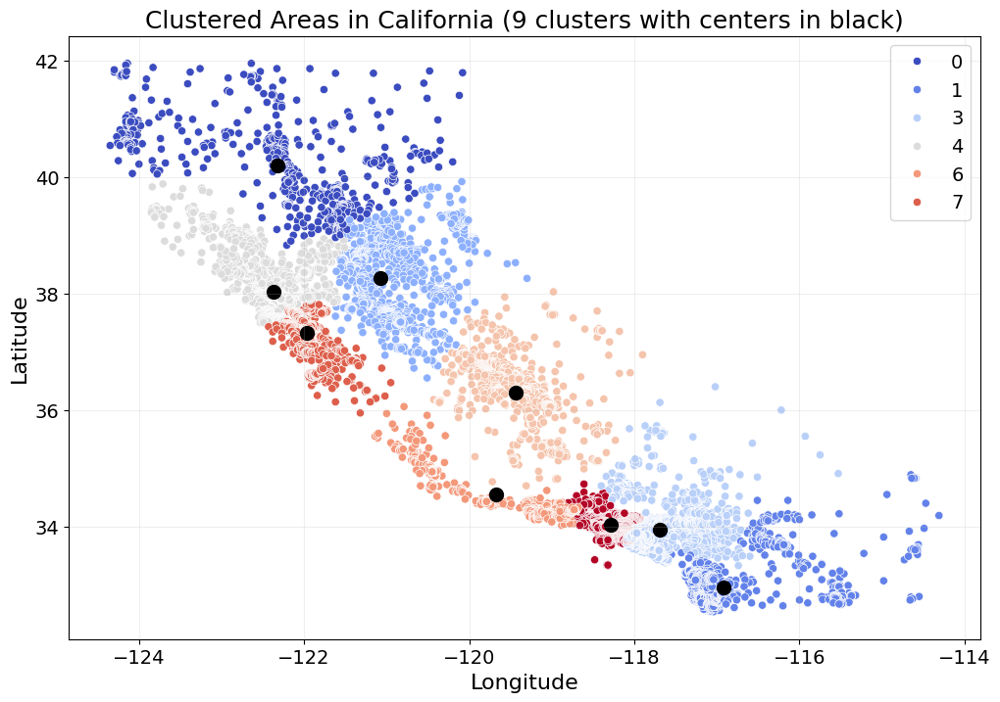
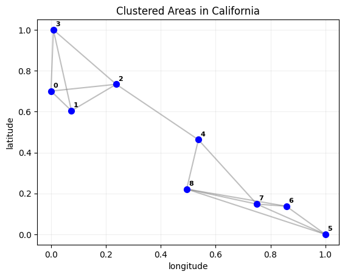
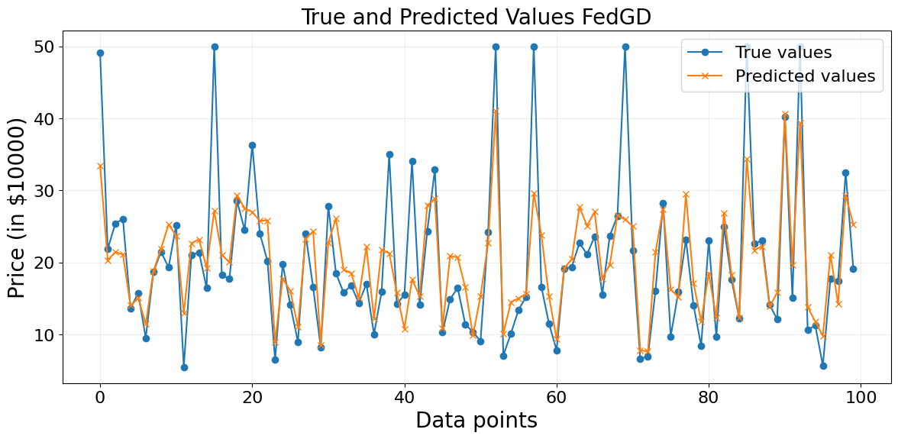
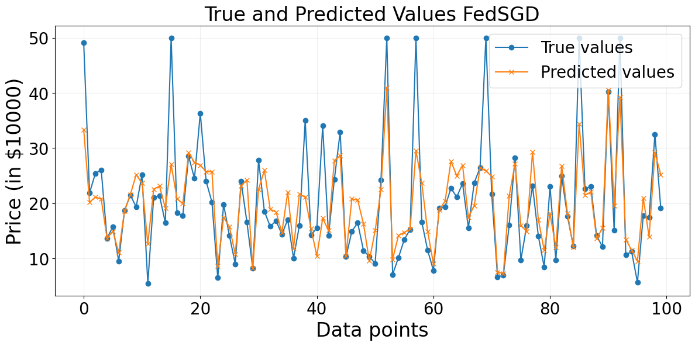

# fl-california-housing

**Decentralized housing price prediction using Federated Learning with the California Housing dataset.**

## Overview
This project implements a **federated learning (FL)** approach to housing price prediction, leveraging **Federated Gradient Descent (FedGD)** and **Federated Stochastic Gradient Descent (FedSGD)**. The model is trained on geographically clustered data from the **California Housing dataset**, ensuring data privacy and decentralized model learning. The study explores the advantages of federated learning over traditional centralized models, demonstrating superior performance with privacy-preserving techniques.

## Features
- **Data Preprocessing**: Cleaning, normalization, and one-hot encoding of categorical features.
- **Geographical Clustering**: 
  - Agglomerative hierarchical clustering based on latitude and longitude.
  - Formation of **9 distinct clusters**, each treated as a local dataset.
- **Federated Learning Algorithms**:
  - **FedGD**: Gradient-based FL with full dataset updates.
  - **FedSGD**: Stochastic gradient-based FL with mini-batch updates.
- **Empirical Graph Construction**:
  - Nodes represent clusters (local datasets).
  - Edges represent geographical proximity, enabling parameter sharing.
- **Model Evaluation**:
  - Comparison of **FedGD, FedSGD, and traditional Linear Regression (LR)**.
  - Performance metrics: **Mean Squared Error (MSE)** on training, validation, and test sets.

## Dataset
The **California Housing dataset** consists of **20,640 instances**, each representing a housing block group. Features include:
- **Geographical**: Latitude, Longitude, Ocean Proximity
- **Housing characteristics**: Median age, Total rooms, Total bedrooms
- **Demographics**: Population, Households, Median income
- **Target variable**: Median house value

## Implementation Details
### 1. Data Preprocessing
- Handling missing values in `total_bedrooms`.
- One-hot encoding for `ocean_proximity`.
- Feature scaling using **Min-Max normalization**.

### 2. Geographical Clustering
- **Agglomerative hierarchical clustering** groups data into **9 clusters**.
- Each cluster represents a **local dataset** for federated learning.

### 3. Empirical Graph Construction
- Nodes represent clusters, and edges connect **k-nearest neighbors** based on geographical proximity.
- Graph structure facilitates parameter sharing across local models.



### 4. Federated Learning Algorithms
- **FedGD**: Gradient-based optimization applied to the **Generalized Total Variation Minimization (GTVMin)** problem.
- **FedSGD**: Stochastic gradient updates using mini-batches.



### 5. Model Performance
| Model  | Train MSE | Validation MSE | Test MSE |
|--------|-----------|----------------|----------|
| FedGD  | 43.14     | 46.37          | 44.62    |
| FedSGD | 43.78     | 46.78          | 45.30    |
| Linear Regression | 50.75 | 54.51 | 53.64 |

- **FedGD consistently outperforms FedSGD**, achieving lower test errors.
- Both federated models significantly outperform traditional **Linear Regression (LR)**.

#### Predicted vs True Housing Prices
**FedGD Predictions:**


**FedSGD Predictions:**


## Usage
### 1. Clone the Repository
```bash
git clone https://github.com/yourusername/fl-california-housing.git
cd fl-california-housing
```

### 2. Install Dependencies

### 3. Run the Code
```bash
jupyter notebook housing.ipynb
```

This will:
- Load and preprocess the California Housing dataset
- Perform geographical clustering of the data
- Train the federated learning models (FedGD and FedSGD)
- Evaluate and compare model performance
- Generate visualizations of the results

## License
This project is licensed under the MIT License - see the LICENSE file for details.


